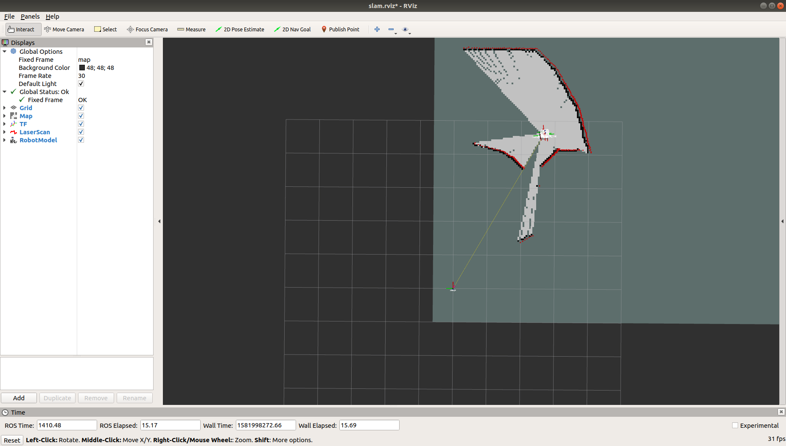
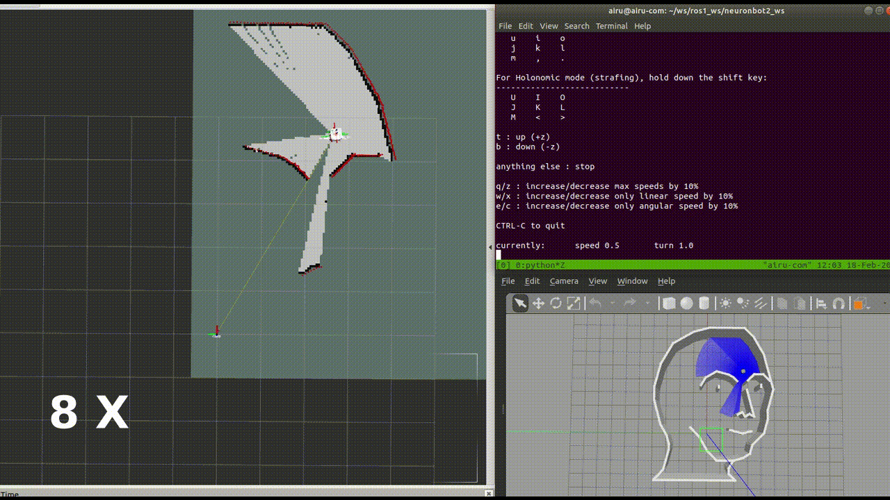

# Neuron APP: SLAM

# Support Platform:

* ADLINK Controller:
  - ROScube-I
  - ROScube-X
  - ROScube starterkit
* ROS version:
  - ROS 2 foxy

# Usage
1. Launch SLAM as well as Rviz while the Gazebo simulation is running.
   
   ***We provide three slam methods.***

   * Gmapping
   ```
   ros2 launch neuronbot2_slam gmapping_launch.py open_rviz:=true use_sim_time:=true
   ```
   * Slam_toolbox
   ``` 
   ros2 launch neuronbot2_slam slam_toolbox_launch.py open_rviz:=true use_sim_time:=true
   ```
   * Cartographer
   ```
   ros2 launch neuronbot2_slam cartographer_launch.py open_rviz:=true use_sim_time:=true
   ```
    
2. Teleop NeuronBot2 to explore the world
   ```
   # Run on the other terminal
   source /opt/ros/foxy/setup.bash
   ros2 run teleop_twist_keyboard teleop_twist_keyboard
   ```
   
3. Save the map
   ```
   source /opt/ros/foxy/setup.bash 
   ros2 run nav2_map_server map_saver_cli -f <map_dir>/<map_name>
   ```

   Then, you shall turn off SLAM.
