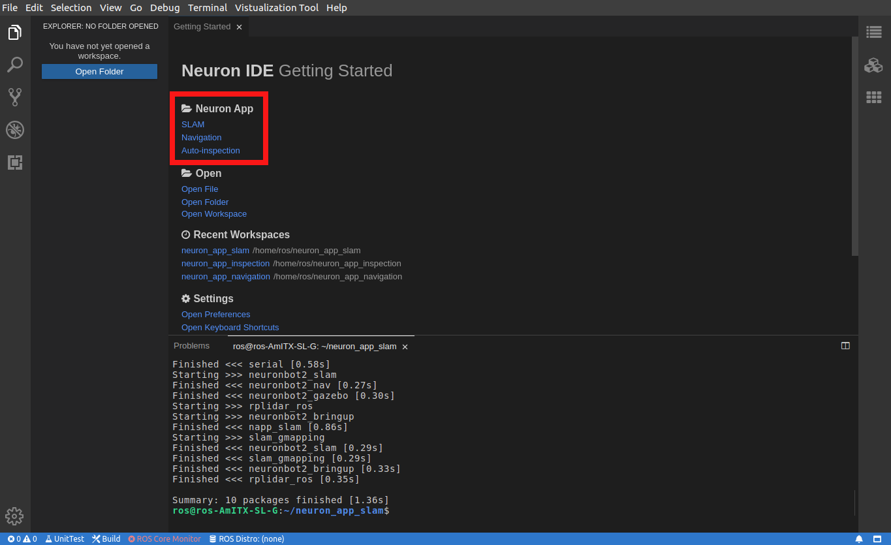
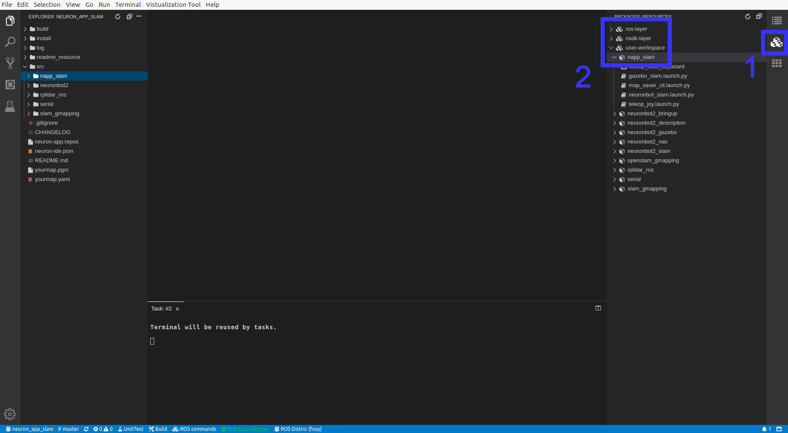
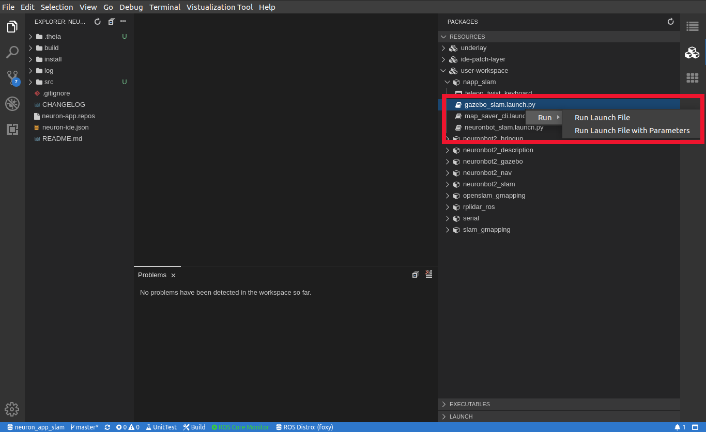

# Neuron APP: SLAM

# Support Platform:

* ADLINK Controller:
  - ROScube-I
  - ROScube-X
  - ROScube starterkit
* ROS version:
  - ROS 2 foxy

# Usage
1. Click application in Neuron App to open workspace. **Click SLAM.**  It will build the resource at first time it's opened.
     
   
2-1. Click "packages" on the right side.

2-2. Open list by click "RESOURCES" -> "user-workspace" -> "napp_slam"
     
     

***NOTE!!! Following instruction would need : Right click desired launch file and click "Run" -> "Run Launch File" as image bellow***

   
     
3. Launch SLAM and Rviz 
   
     For simulation, launch SLAM application and Gazebo simultaneously. **Launch gazebo_slam.launch.py**

4. Teleop NeuronBot2 to explore the world, **Run teleop_twist_keyboard**

   
   
5. Save the map, **Launch map_saver_cli.launch.py**

   The saved map will be stored in directory of neuron_app_slam, which is "yourmap.yaml" and "yourmap.pgm".

   Then, you shall turn off SLAM.
